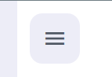
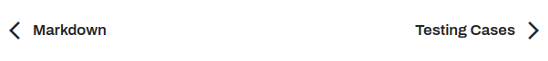

# Keyboard Shortcuts

|  Name            | Key          |
|------------------|--------------|
| Toggle Sidebar   | <kbd>k</kbd> |
| Change Theme     | <kbd>t</kbd> |
| Edit Chapter     | <kbd>e</kbd> |
| View Repository  | <kbd>r</kbd> |
| Search           | <kbd>s</kbd> |
| Previous Chapter | <kbd>←</kbd> |
| Next Chapter     | <kbd>→</kbd> |

## Manual Navigation

### Sidebar Toggle

## Theme Toggle/Edit Chapter/View Repository

### Search

### Previous Chapter - Next Chapter

